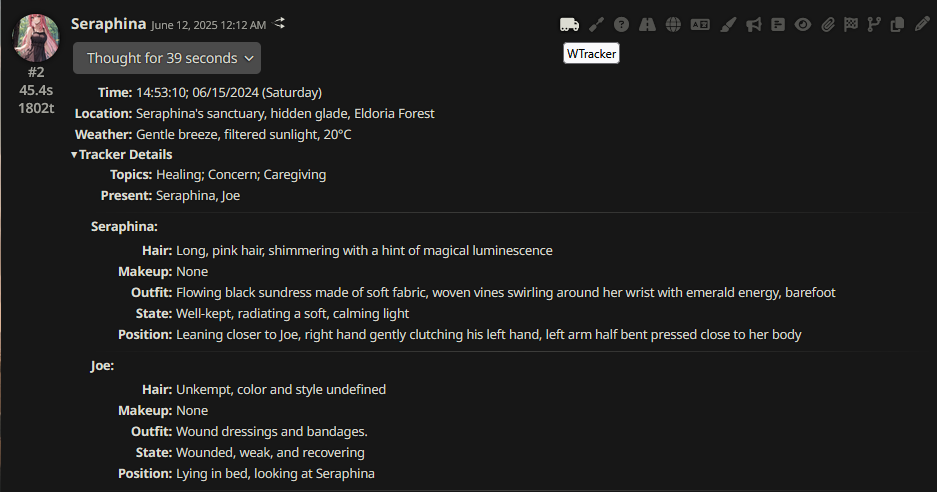
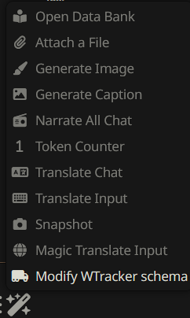

# SillyTavern WTracker

## Overview

A [SillyTavern](https://docs.sillytavern.app/) extension that helps you track your chat stats with LLMs using [connection profiles](https://docs.sillytavern.app/usage/core-concepts/connection-profiles/).



---



---


---

**If you are using a _Text Completion_ profile, make sure your profile contains API, preset, model, and instruct.**

**If you are using a _Chat Completion_ profile; API, settings, model would be enough.**

---

## Installation

Install via the SillyTavern extension installer:

```txt
https://github.com/bmen25124/SillyTavern-WTracker
```

## FAQ

>I'm having API error.

Your API/model might not support structured output. Change `Prompt Engineering` mode from `Native API` to `JSON` or `XML`.

> What is the difference compared to [famous tracker](https://github.com/kaldigo/SillyTavern-Tracker)?

Most importantly, it works. This is minimalistic version of the original tracker.
- No annoying connection profile switch.
- No "Prompt Maker" option. Because json schema is easy enough to edit.
- No "Generation Target" option. (Could be added in the future)
- No "Generation Mode" option. Since this extension doesn't summarizing the chat, no need it. (I'm not planning to add summarize feature.)
- There are some templates in original, I don't need them since I don't have those features.
